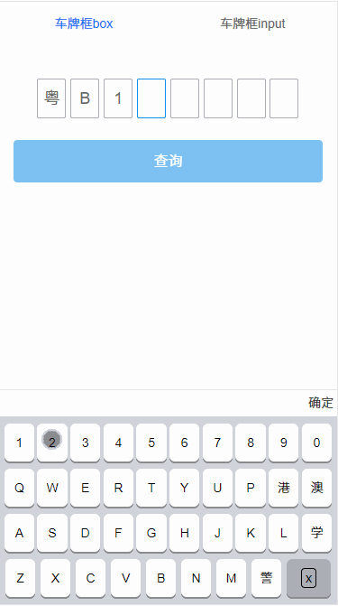

# Keyboard

一个基于vue的自适应车牌键盘独立组件。   
[原生js面向对象版车牌键盘](https://github.com/AsaZws/binding/tree/master/plate-object)    
[基于jq面向过程版车牌键盘](https://github.com/AsaZws/binding/tree/master/input1.4)    

## 必要文件和截图
1. [keyboardBox](https://github.com/AsaZws/Keyboard/tree/master/src/views/plateBox)是格子车牌输入框组件    
2. [plateInput](https://github.com/AsaZws/Keyboard/tree/master/src/views/plateInput)是车牌input输入框组件    
3. [Keyboard](https://github.com/AsaZws/Keyboard/tree/master/src/views/keyboard)车牌键盘、[keyboardButton](https://github.com/AsaZws/Keyboard/tree/master/src/views/keyboardButton)按钮都是公共组件，为实现组件复用，目前两种车牌框的方式都引入的同一个组件，引入的相关文件都要放入项目中的    
4. [components](https://github.com/AsaZws/Keyboard/tree/master/src/components)是tab切换的公共组件，目前切换用的是vue-router-3.0.1版本的，具体配置请参考[router](https://github.com/AsaZws/Keyboard/blob/master/src/router/router.js)配置   
5. 父子组件通信是用的props，兄弟组件通信是用的[事件总线](https://github.com/AsaZws/Keyboard/blob/master/src/event.js)    
6. 如果苹果真机点击也想改变背景颜色的话，就需要在public文件夹里面中index.html的body加入 ontouchstart="" οnmοuseοver=""。    


## Project setup
```
npm install
```

### Compiles and hot-reloads for development
```
npm run serve
```

### Compiles and minifies for production
```
npm run build
```

### Run your tests
```
npm run test
```

### Lints and fixes files
```
npm run lint
```